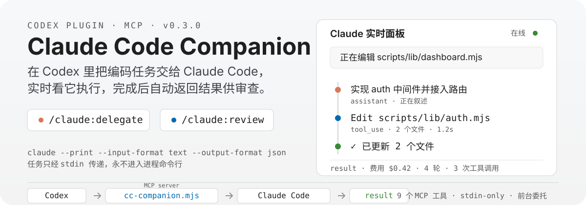

<p align="center">
  
</p>

# Claude Code Companion

> 在 Codex 中把编码任务委托给 Claude Code 执行，实时观察它的每一步动作，完成后自动返回结果供 Codex 审查。

一个 [Codex](https://codex.openai.com/) 插件，实现 **Codex → Claude Code** 方向的集成。与 OpenAI 官方的 `codex-plugin-cc`（Claude Code → Codex）方向相反，互为补充。

## 为什么用它

- **前台委托，无需轮询** — 一次 `cc_delegate` 调用保持 pending，Claude Code 完成、失败或取消后自动返回结果
- **模型选择灵活** — 默认继承你当前 Claude Code 配置；也可用 alias（`Opus`/`Fable`/`Sonnet`/`Haiku`）或原生模型 ID（如 `deepseek-v4-pro`），真实执行模型以 Claude transcript 证据为准
- **实时面板** — 委托期间在本机 `127.0.0.1` 起一个只读 dashboard，浏览器实时展示 Claude 的叙述、工具调用与结果
- **隐私设计** — 任务文本只经 stdin 传递，永不进入任何进程命令行；事件仅存于内存，不落盘
- **双模式审查** — 标准审查（正确性/bug/安全/性能）或对抗审查（质疑实现选择、分析攻击面）
- **有界续作** — 审查后修复默认开启新会话并传递精简交接包，避免上下文无限膨胀；也可显式恢复指定会话
- **失败可诊断** — 失败时返回脱敏的错误分类与阶段，私密证据留存在本机 job artifact

## 快速开始

### 前置条件

- [Codex](https://codex.openai.com/) 已安装
- [Claude Code](https://docs.anthropic.com/en/docs/claude-code) 已安装并认证：`npm install -g @anthropic-ai/claude-code`
- Node.js >= 22

### 安装

```bash
# 1. 添加本仓库作为 marketplace
codex plugin marketplace add wubq511/cc-plugin-codex

# 2. 安装插件
codex plugin add cc-plugin-codex
```

验证安装：

```
/claude:setup
```

### 更新

```bash
# 更新 marketplace 缓存（拉取最新代码）
codex plugin marketplace update wubq511/cc-plugin-codex

# 重新安装以应用更新
codex plugin add cc-plugin-codex
```

安装后需要打开新的 Codex 任务加载新版本。

### 第一次使用

在 Codex 中直接说：

```
把 auth 中间件实现出来，交给 Claude Code 做
```

插件会调用 `cc_delegate`，打开实时面板，等待 Claude Code 完成后返回结果。完成后再执行：

```
/claude:review
```

对产出做一次标准审查。

## 实时面板

委托任务期间，插件在本机 `127.0.0.1` 随机端口启动一个只读 dashboard（首次 delegate 自动在浏览器打开，或通过 `/claude:setup` 输出的 URL 收藏备用）。

面板实时渲染 Claude 的每一步动作：

- **assistant 文本块** — Claude 的叙述是主信号，思考过程折叠为可展开的一行
- **工具卡** — `tool_use` 与 `tool_result` 配对成一张卡：参数摘要 + 耗时，成功输出折叠、错误输出自动展开高亮
- **最终 result** — 任务完成时的汇总卡（费用、耗时、轮数）

顶栏状态区实时显示当前动作、阶段、已耗时、轮数与费用；「resume」按钮一键复制 `claude --resume <sessionId>` 命令。时间线自动跟随最新事件，向上滚动暂停。

面板是纯只读观察者：事件只在内存 ring buffer（每 job 最多 500 条），永不落盘；URL 带随机 token 鉴权，无 token 请求一律 403。

开关：

| 环境变量 | 作用 |
|----------|------|
| `CC_COMPANION_DASHBOARD_OPEN=off` | 关闭自动打开浏览器（CI 与无显示器 Linux 环境自动关闭） |
| `CC_COMPANION_DASHBOARD=off` | 完全禁用面板 |

## 常用操作

| 操作 | 输入 | 说明 |
|------|------|------|
| 分派任务 | `/claude:delegate` | 默认继承当前 Claude Code 配置；`model` 支持 alias/native |
| 查看状态 | `/claude:status` / `/claude:status --all` | 最新任务 / 所有任务 |
| 标准审查 | `/claude:review` | 检查正确性、bug、安全、性能、可维护性 |
| 对抗审查 | `/claude:review --adversarial` | 质疑实现选择，分析攻击面，要求具体代码位置与修复建议 |
| 取消任务 | `/claude:cancel` | 取消运行中的任务（可指定 job ID 前缀） |
| 环境检查 | `/claude:setup` | 静态零成本检查（可选付费 liveness probe，见下） |
| 压缩会话 | `/claude:compact` | 对已停止的会话运行只读 `/compact`，诚实报告是否跨越压缩边界 |

### 模型选择

`cc_delegate` 的 `model` 参数支持三种选择器：

| 选择器 | 写法 | 行为 |
|--------|------|------|
| **inherited**（默认） | 省略 `model` | 不传 `--model`，完全继承当前 Claude Code 配置的 Provider 与模型 |
| **alias** | `Opus` / `Fable` / `Sonnet` / `Haiku` | 标准化为 Claude CLI alias 后透传 |
| **native** | `deepseek-v4-pro` / `glm-5.2` | 严格语法校验后原样透传 |

不明确的模型描述会被拒绝（fail closed），插件不猜测、不 fallback，也不读取任何外部路由配置。真实执行模型只以 Claude transcript 证据为准。`cc_resolve_route` 可在不发起模型调用的情况下预览路由解析结果。

### 继续修复：有界交接

审查发现问题后再次分派时，默认开启新的 Claude Code 会话。Codex 只交接当前目标、可执行的审查发现、仍有效的约束和验收命令，Claude Code 从当前工作区与 git diff 核对真实状态——不会把完整旧会话或冗长日志重复塞入新上下文。

只有你明确要求「继续同一个 Claude Code 会话」或指定 session ID 时，插件才会使用 `resume`。

### 在终端续接插件会话

插件通过 `claude -p`（print 模式）执行任务，这类会话不会出现在交互式 `/resume` 列表中（Claude Code 官方行为）。要继续某个插件会话，需按 session ID 恢复。

每次任务返回（成功、失败、取消）以及 `cc_check` 单任务输出里，只要该 job 持有 `claudeSessionId`，就会附带一行「**终端续接：**」：

```
claude --resume <sessionId>
```

在 workspace 根目录运行即可。session ID 也可在 `cc_check` 的任务详情中找到。

### 自动压缩

`cc_delegate` 的 `autoCompact` 参数为单个 delegation / session / task 设置临时压缩策略，通过 Claude CLI 内联 `--settings` 注入，不修改 `~/.claude/**`、项目 `.claude/` 或父进程环境：

```json
{ "contextWindowTokens": 256000, "targetTokens": 230000, "scope": "delegation" }
```

- `scope`：`delegation`（默认，仅当前进程）/ `session`（绑定会话，resume 时重放）/ `task`（覆盖同一 Codex 任务的所有 delegation，通过 `taskScopeId` 继承）
- 优先级：本次显式值 > session > task > 无
- 输出区分 `target`（名义值）、`effectiveWindow`（计算值）与 `observedBoundary`（transcript 实测，可能为 null）——自定义 Provider 实际窗口更小时，插件不承诺精确命中声明值

### 环境检查与 liveness probe

`/claude:setup` 默认只做零成本静态检查（CLI 协议、源码/cache 比对、模型路由分类器、状态 schema 健康）。

**会产生费用：** 只有你明确授权时，`cc_setup` 才带 `livenessProbe: true`、正整数 `timeoutSeconds` 和正数 `maxBudgetUsd` 执行一次最小模型调用，验证 Provider 真实连通性。失败会保留私有、脱敏的 probe 制品并返回安全 stage/reason。不要在 CI 中启用 liveness probe。

## MCP 工具

插件通过 MCP server 暴露 9 个工具，供 Codex 直接调用：

| 工具 | 说明 |
|------|------|
| `cc_delegate` | 分派编码任务给 Claude Code（支持 alias/native 模型路由、autoCompact 临时压缩策略、continuationPlan 延续计划） |
| `cc_resolve_route` | 只读模型路由解析器（不发起模型调用，不枚举 Provider 模型） |
| `cc_list_models` | 报告模型解析行为和最近完成任务的路由/模型证据信息 |
| `cc_check` | 查看任务状态/结果（重复查询返回结果指纹，不重复投递完整结果） |
| `cc_cancel` | 取消运行中的任务（`running → cancelling → cancelled`，确认进程树退出与状态收口） |
| `cc_review` | 审查代码变更 |
| `cc_setup` | 环境检查（静态零模型调用 + 可选付费 liveness probe） |
| `cc_compact` | 对已停止的 Claude Code 会话运行只读 `/compact`，诚实报告是否跨越压缩边界 |
| `cc_plan_continuation` | 只读延续规划器（零模型调用，基于上一轮 token 用量选择 resume / compact_resume / fresh_handoff） |

## 它是怎么工作的

```text
Codex ↔ cc-companion.mjs ↔ claude-runner.mjs ↔ watchdog.mjs ↔ Claude Code CLI
```

1. Codex 调用 MCP 工具（stdio 传输），任务经 stdin 传给 watchdog 子进程，不经过任何进程命令行
2. watchdog 以 `claude --print --input-format text --output-format json` 前台运行 Claude Code，同时把事件流转发给 dashboard
3. MCP 调用保持 pending，直到 Claude Code 完成、失败或取消——无需轮询
4. 结果返回 Codex，附带费用、耗时、轮数等证据；你接着用 `cc_review` 审查产出

设计上只做「委托」一件事：不读外部路由配置、不改永久配置、不做后台模式、不绕过权限（`dangerouslySkipPermissions` 仅显式传入时才开启；`write=false` 时只暴露 Read/Glob/Grep）。

## 本地验证

```bash
npm test               # 单元与集成测试
npm run verify:source  # 测试 + 语法 + 清单 + schema 校验
npm run verify         # 完整发布验证：更新 cachebuster、重装插件、比对 source/cache、测试已安装副本
```

CI（`.github/workflows/ci.yml`）在 Ubuntu / macOS / Windows × Node 22 / 24 上运行。

## License

[MIT](LICENSE)
